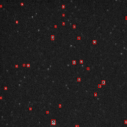

# SpaceObjectDetection

Lightweight toolkit for detecting and evaluating space / astronomical objects in images using classical methods.

## Features

- **Input support**: FITS, TIFF, PNG, JPEG, BMP.  
- **Detectors implemented in `detect.py`**:
  - **OtsuDetector**: Global Otsu thresholding followed by connected component analysis.  
  - **SExtractor** (via `sep`): Background modeling and source extraction analogous to SExtractor.  
  - **PoissonThresholding**: Minimum-error threshold selection (Gaussian or Poisson) + connected region extraction.  
- **Evaluation in `metric.py`**: Matches detections to YOLO-format ground truth, computes Precision / Recall / F1 / average localization error, and produces per-file and aggregated summaries.  
- **Batch driver `test_series.py`**: Applies a chosen detector over a directory of images, collects outputs, and runs evaluation against annotations.

## Recommended Workflow

1. Prepare image dataset and corresponding YOLO-format annotations (one `.txt` per image).  
2. Use `detect.py` (via its detectors) to process images and generate detection outputs and visualizations.  
3. Run `test_series.py` to batch process a folder and invoke `metric.py` to evaluate detections.  
4. Inspect evaluation summaries (JSON/CSV) for performance metrics.

## Metrics

- **Precision**: Correct detections over all predicted.  
- **Recall**: Correct detections over ground truth count.  
- **F1-score**: Harmonic mean of precision and recall.  
- **Average Localization Error (ALE)**: Mean distance between matched prediction and ground truth centers.  
- Matching uses greedy nearest neighbor within a radius; each ground truth is matched at most once.

## Illustration Placeholder

  

